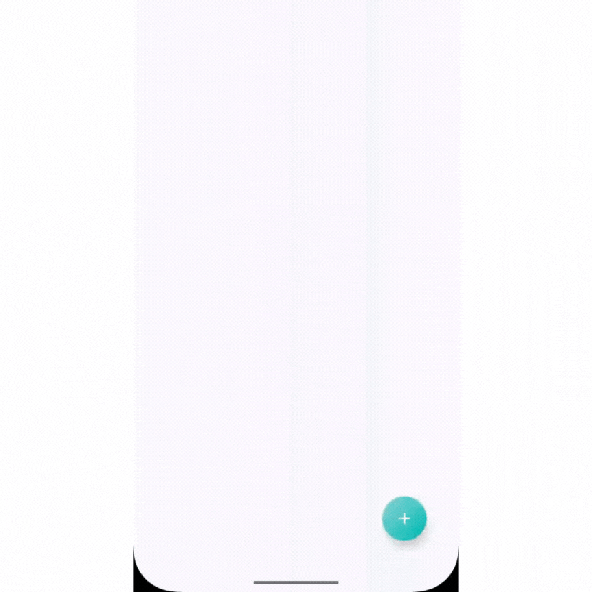
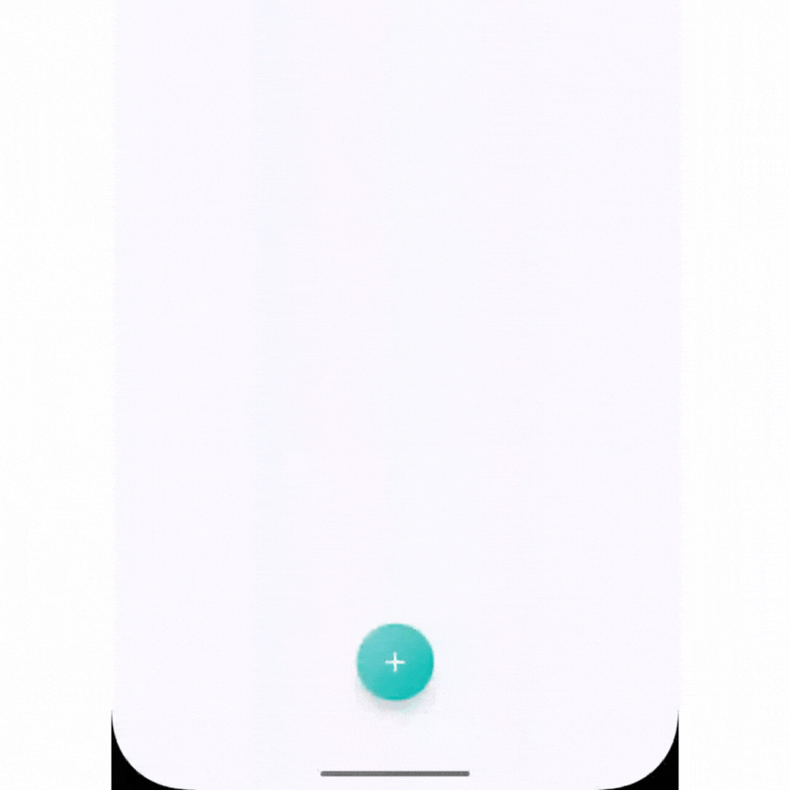
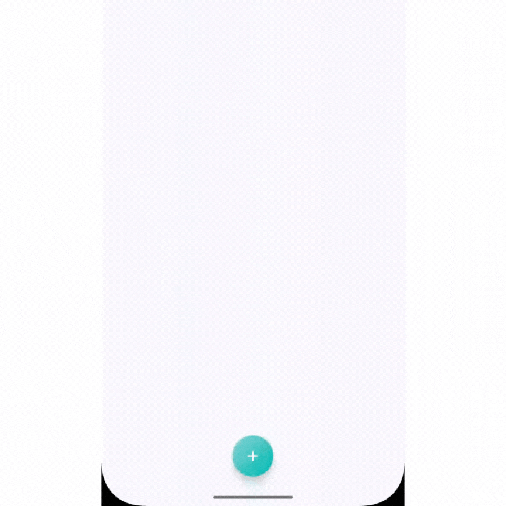
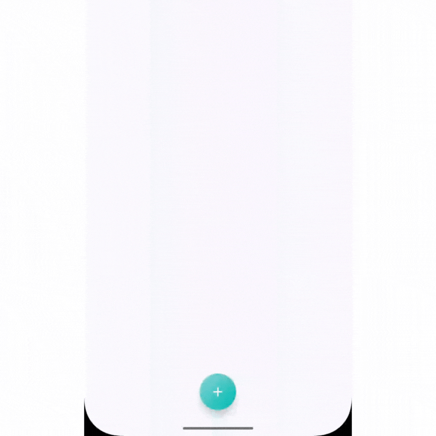
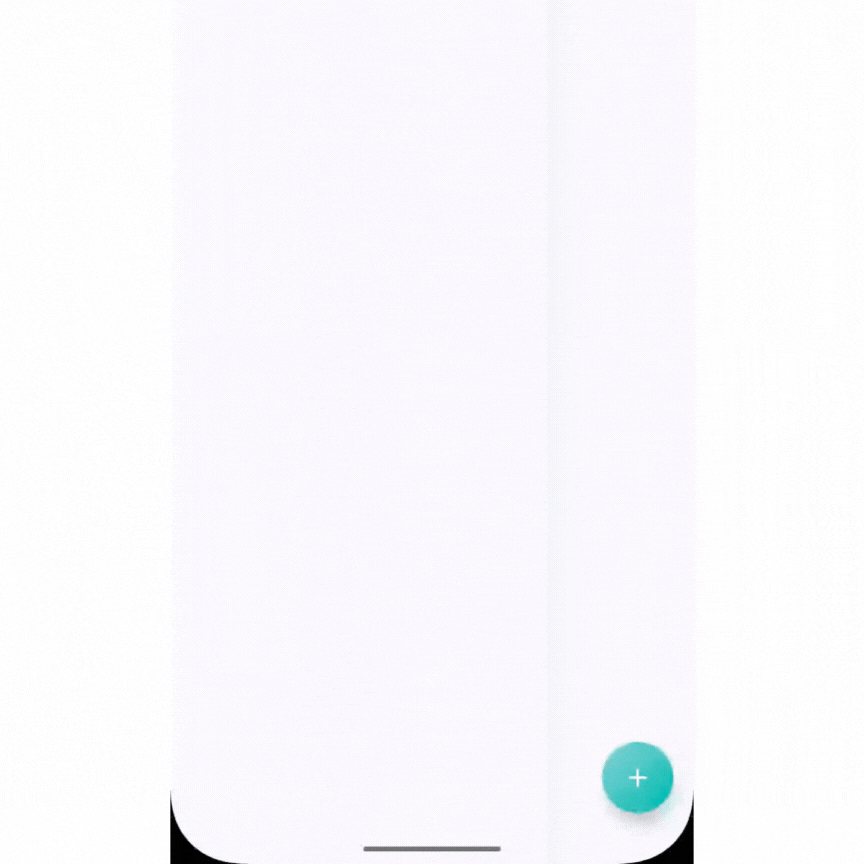

# Radial Action Button for Jetpack Compose

[](https://search.maven.org/artifact/io.github.namle197/compose-radial-action-button)
[](https://opensource.org/licenses/MIT)

A customizable radial action button menu for Android Jetpack Compose.

## Installation

Add to your `build.gradle.kts`:

```kotlin
dependencies {
    implementation("io.github.namle197:compose-radial-action-button:0.1.0")
}
```
## Features
- Circular layout.
- Customize the number of items / style.
- Change animations.
- Turn on/off stabilized center

## Showcases


```
expanded = expanded,
span = CircularSpan.Circle.create(),
startAngle = 180f,
clockwise = CircularDirection.Clockwise,
animation = CircularAnimation.StaggerAnimation(),
moveUpEnabled = true,
```


```
span = CircularSpan.Angle(180f),
startAngle = 180f,
clockwise = CircularDirection.CounterClockwise,
```



```
span = CircularSpan.Angle(180f),
startAngle = 180f,
clockwise = CircularDirection.CounterClockwise,
animation = CircularAnimation.ExpandAnimation()
```



```
span = CircularSpan.Angle(180f),
startAngle = 180f,
clockwise = CircularDirection.CounterClockwise,
animation = CircularAnimation.ExpandAnimation(),
moveUpEnabled = false,
```



```
span = CircularSpan.Angle(90f),
startAngle = 180f,
clockwise = CircularDirection.Clockwise,
animation = CircularAnimation.ExpandAnimation(),
moveUpEnabled = false,
```